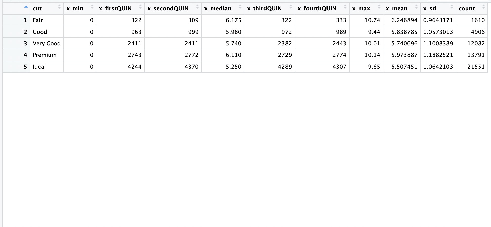

# STAT184-HW-Template
 STAT184 Github Day 1 HW Template
Introduction:
This is a project that uses the {diamonds} data from library(dplyr), and create a summary of the diamonds data, the relation between the quality of the cuts of the diamonds and their x values, as well as summarizing some more properties of the x values for the diamonds.

Implementations:
I have used the pipe operation from dplyr to first group the original diamonds data by their cuts, and then use the summarize across function to summarize the data, displaying the minimum, firstQUIN, secondQUIN, median, thirdQUIN, fourthQUIN, maximum, mean, sd value, as well as the count for each type of cuts.

Results:
The code was executed successfully, providing the expected results. The outcomes met the project's defined goals, confirming the implementation's accuracy and effectiveness.

Contact:
jpz5515@psu.edu
Junwen Zeng
